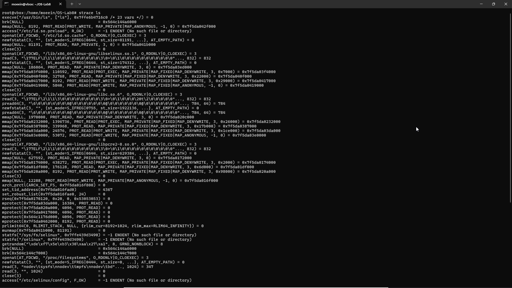

# آزمایش ۸ - آشنایی با توابع سیستمی

- گروه شماره ۲۵
  - معین آعلی - ۴۰۱۱۰۵۵۶۱
  - ثمین اکبری - ۴۰۱۱۰۵۵۹۴

## بخش ۱ - ماژول سطح هسته


برای ساخت یک ماژول در سطح
هسته نیاز است تا هدر ها نصب باشند. 
ابتدا با استفاده از دستور زیر هدرهای مختص ورژن فعلی کرنل را نصب می‌کنیم:

```bash
sudo apt install -y build-essential linux-headers-$(uname -r)
```

حال `Makefile`
را می‌سازیم:

```Makefile
obj-m += syscall_dump.o

KDIR := /lib/modules/$(shell uname -r)/build
PWD  := $(shell pwd)

all:
	$(MAKE) -C $(KDIR) M=$(PWD) modules

clean:
	$(MAKE) -C $(KDIR) M=$(PWD) clean
```

در ادامه کد ماژول:

```C
#include <linux/module.h>
#include <linux/kernel.h>
#include <linux/kprobes.h>
#include <linux/printk.h>
#include <linux/version.h>
#include <linux/uaccess.h>
#include <linux/compiler.h>
#include <linux/types.h>
#include <asm/unistd.h>  

MODULE_LICENSE("GPL");
MODULE_AUTHOR("moeein");
MODULE_DESCRIPTION("Print addresses of all Linux syscalls :)))");
MODULE_VERSION("1.0");

static void **sys_call_table_ptr;

static int __init syscall_dump_init(void)
{
	int ret;
	unsigned int i;
	struct kprobe kp = {
		.symbol_name = "sys_call_table",
	};

	ret = register_kprobe(&kp);
	if (ret < 0) {
		pr_err("syscall_dump: register_kprobe failed: %d\n", ret);
		return ret;
	}

	sys_call_table_ptr = (void **)kp.addr;
	unregister_kprobe(&kp);

	if (!sys_call_table_ptr) {
		pr_err("syscall_dump: sys_call_table is NULL\n");
		return -EINVAL;
	}

	pr_info("syscall_dump: sys_call_table @ %px\n", sys_call_table_ptr);
	pr_info("syscall_dump: NR_syscalls = %u\n", (unsigned int)NR_syscalls);

	for (i = 0; i < (unsigned int)NR_syscalls; i++) {
		void *entry = READ_ONCE(sys_call_table_ptr[i]);
		if (!entry)
			continue;
		pr_info("syscall_dump: %4u: %px (%pS)\n", i, entry, entry);
	}

	pr_info("syscall_dump: done.\n");
	return 0;
}

static void __exit syscall_dump_exit(void)
{
	pr_info("syscall_dump: unloaded.\n");
}

module_init(syscall_dump_init);
module_exit(syscall_dump_exit);
```

این ماژول را بارگذاری می‌کنیم تا بتوانیم جدول sys_call_table را در کرنل لینوکس بیابیم. ابتدا با استفاده از یک `kprobe` به نشانی این جدول دسترسی پیدا می‌کنم و پس از آن بلافاصله `kprobe` را آزاد می‌نمایم. در صورتی که این جدول در دسترس نباشد، خطا بازگردانده می‌شود. سپس نشانی جدول و تعداد کل سیستم‌کال‌ها (`NR_syscalls`) را در خروجی کرنل ثبت می‌کنم. در ادامه با پیمایش تمام اندیس‌های جدول، نشانی هر سیستم‌کال را به‌طور ایمن می‌خوانم و در صورتی که معتبر باشد، هم نشانی خام آن و هم نام نمادین تابع متناظر را در لاگ کرنل چاپ می‌کنم. در پایان، تکمیل فرایند را گزارش می‌دهم و هنگام حذف ماژول نیز تنها پیامی مبنی بر بارزدایی آن ثبت می‌گردد.


حال `Makefile`
را با استفاده از دستور زیر اجرا می‌کنیم تا ماژول بیلد شود:

```
make
```

در ادامه با دسترسی `root`
ماژول ساخته شده را داخل کرنل بارگزاری می‌کنیم:

```bash
sudo insmod syscall_dump.ko
```

حال با استفاده از دستور 
`sudo dmesg`
لاگ‌ها را مشاهده می‌کنیم:


می‌بینیم که با موفقیت این ماژول هسته‌ کار می‌کند.


## بخش ۲ - هوک کردن توابع سیستمی

در این بخش باید با استفاده از 
`LD_PRELOAD`
یک `shared_library`
ایجاد کنیم که رفتار طبیعی دستور 
`ls`
را تغییر می‌دهد.

ابتدا با استفاده از دستور 
`strace ls`
لیست سیس‌کال‌های مورد استفاده در
`ls`
را بررسی می‌کنیم:

```
apt install strace
strace ls
```




ابتدا فایل fakels.c را ایجاد کرده و کد زیر را در آن قرار می‌دهیم:

```C
struct linux_dirent64 {
    uint64_t d_ino;
    int64_t d_off;
    uint16_t d_reclen;
    uint8_t d_type;
    char d_name[];
};

static const char* fake_file_name = "faketext.txt";
static const char* fake_dir_name = "fakefile";

static ssize_t (*real_getdents64)(int, void*, size_t) = NULL;
static int (*real___xstat)(int, const char*, struct stat*) = NULL;
static int (*real_lstat)(const char*, struct stat*) = NULL;

static int fake_file_returned = 0;
static int fake_dir_returned = 0;

int is_fake_path(const char* path, int* type) {
    size_t path_len = strlen(path);
    size_t file_len = strlen(fake_file_name);
    size_t dir_len = strlen(fake_dir_name);

    if (path_len >= file_len && strcmp(path + path_len - file_len, fake_file_name) == 0) {
        *type = DT_REG;
        return 1;
    }
    
    if (path_len >= dir_len && strcmp(path + path_len - dir_len, fake_dir_name) == 0) {
        *type = DT_DIR;
        return 1;
    }

    *type = 0;
    return 0;
}

ssize_t getdents64(int fd, void* dirp, size_t count) {
    if (!real_getdents64) {
        real_getdents64 = dlsym(RTLD_NEXT, "getdents64");
    }

    ssize_t bytes_read = real_getdents64(fd, dirp, count);
    if (bytes_read == -1) {
        return -1;
    }

    struct linux_dirent64* d;
    char* bpos;

    if (!fake_file_returned && !fake_dir_returned) {
        d = (struct linux_dirent64*) dirp;
        bpos = (char*) dirp;

        if (count - bytes_read >= sizeof(struct linux_dirent64) + strlen(fake_dir_name) + 1) {
            d->d_ino = 12345679;
            d->d_off = bytes_read;
            d->d_type = DT_DIR;
            strcpy(d->d_name, fake_dir_name);
            d->d_reclen = sizeof(struct linux_dirent64) + strlen(d->d_name) + 1;
            
            bytes_read += d->d_reclen;
            d = (struct linux_dirent64*)((char*)d + d->d_reclen);
            fake_dir_returned = 1;
        }

        if (count - bytes_read >= sizeof(struct linux_dirent64) + strlen(fake_file_name) + 1) {
            d->d_ino = 12345678;
            d->d_off = bytes_read;
            d->d_type = DT_REG;
            strcpy(d->d_name, fake_file_name);
            d->d_reclen = sizeof(struct linux_dirent64) + strlen(d->d_name) + 1;

            bytes_read += d->d_reclen;
            fake_file_returned = 1;
        }
    }

    return bytes_read;
}


int __xstat(int ver, const char *path, struct stat *buf) {
    if (!real___xstat) {
        real___xstat = dlsym(RTLD_NEXT, "__xstat");
    }

    int type;
    if (is_fake_path(path, &type)) {
        memset(buf, 0, sizeof(struct stat));
        buf->st_uid = geteuid();
        buf->st_gid = getegid();
        buf->st_ino = (type == DT_REG) ? 12345678 : 12345679;

        if (type == DT_REG) {
            buf->st_mode = S_IFREG | 0755;
            buf->st_size = 100;
        } else {
            buf->st_mode = S_IFDIR | 0755;
            buf->st_size = 4096;
        }
        return 0;
    }
    return real___xstat(ver, path, buf);
}

int lstat(const char *path, struct stat *buf) {
    if (!real_lstat) {
        real_lstat = dlsym(RTLD_NEXT, "lstat");
    }

    int type;
    if (is_fake_path(path, &type)) {
        memset(buf, 0, sizeof(struct stat));
        buf->st_uid = geteuid();
        buf->st_gid = getegid();
        buf->st_ino = (type == DT_REG) ? 12345678 : 12345679;

        if (type == DT_REG) {
            buf->st_mode = S_IFREG | 0755;
            buf->st_size = 100;
        } else {
            buf->st_mode = S_IFDIR | 0755;
            buf->st_size = 4096;
        }
        return 0;
    }
    return real_lstat(path, buf);
}
```

در ادامه با استفاده از دستور زیر آن را کامپایل کرده و آن را به یک 
`shared_library`
تبدیل می‌کنیم:

```bash
gcc -shared -fPIC -o fake_ls.so fake_ls.c
```

و در نهایت `ls`
را با استفاده از 
`LD_PRELOAD`
به واسطه دستور زیر اجرا می‌کنیم:

```bash
LD_PRELOAD="./fakels.so" ls /home/moeein/OS-Lab8/test
```

نتایج اجرا:


توضیحات:

- `is_fake_path`: این تابع بررسی می‌کند که آیا مسیر داده‌شده به یکی از نام‌های ساختگی (`faketext.txt` یا `fakefile`) ختم می‌شود یا نه. اگر بله، نوع آن (فایل معمولی یا دایرکتوری) را در آرگومان خروجی type می‌نویسد و مقدار ۱ برمی‌گرداند؛ در غیر این صورت صفر برمی‌گرداند. به این ترتیب، توابع دیگر می‌توانند تشخیص دهند که آیا باید برای این مسیر، اطلاعات ساختگی تولید کنند یا نه.
- `getdents64`: این نسخه‌ی هوک‌شده‌ی تابع سیستمی `getdents64` است که برای خواندن محتوای یک دایرکتوری استفاده می‌شود. ابتدا نسخه‌ی اصلی را صدا می‌زند تا لیست واقعی فایل‌ها را بگیرد. سپس، اگر هنوز فایل‌ها/دایرکتوری‌های ساختگی اضافه نشده باشند، دو ورودی جدید به نام‌های `fakefile` (دایرکتوری) و `faketext.txt` (فایل معمولی) به انتهای بافر اضافه می‌کند. در نهایت تعداد بایت‌ها را با احتساب این ورودی‌های اضافی برمی‌گرداند و باعث می‌شود ابزارهایی مثل ls این اسامی خیالی را هم ببینند.
- `__xstat`: این تابع جایگزین نسخه‌ی درونی `glibc` برای stat است. اگر مسیر ورودی یکی از فایل‌های ساختگی باشد، ساختار stat را به‌طور مصنوعی پر می‌کند: شماره‌ی inode، مالک و گروه، نوع (فایل یا دایرکتوری) و مجوزها. برای فایل معمولی اندازه‌ی ۱۰۰ بایت می‌گذارد و برای دایرکتوری ۴۰۹۶ بایت. سپس موفقیت (۰) برمی‌گرداند و به این شکل برنامه را فریب می‌دهد که انگار این مسیر روی دیسک وجود دارد. اگر مسیر ساختگی نباشد، درخواست به نسخه‌ی اصلی `__xstat` فرستاده می‌شود.
- `lstat`: این تابع هم مشابه `__xstat` عمل می‌کند اما مخصوص درخواست‌هایی است که از `lstat` استفاده می‌کنند (اطلاعات فایل یا لینک نمادین). وقتی مسیر داده‌شده یکی از اسامی ساختگی باشد، اطلاعات قلابی مشابه `__xstat` پر می‌شود؛ و اگر نباشد، کار به نسخه‌ی واقعی `lstat` سپرده می‌شود. به این ترتیب، هر دو مسیر بررسی فایل (چه با stat و چه با `lstat`) برای اسامی ساختگی پوشش داده می‌شوند.